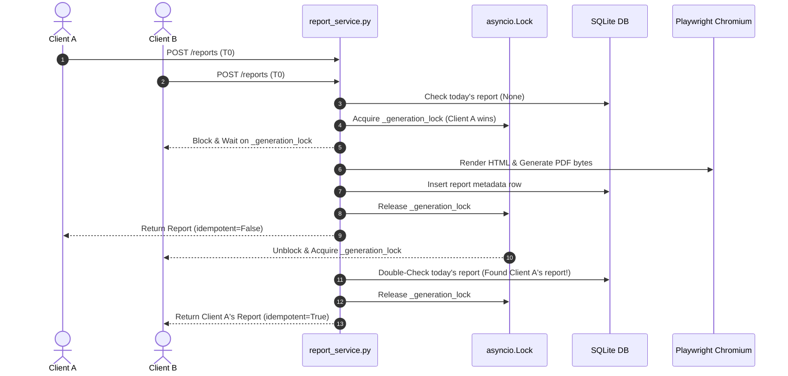

# BE-08: PDF Report Generator & Immediate Streaming API

An executive analytics and PDF reporting engine built as part of the FlyRank Backend Track. This project queries book scraping data collected in **BE-06-Scraper**, generates branded PDF reports formatted according to the **FL-05 Identity Kit**, and serves reports via both standard file links and an advanced **immediate PDF streaming endpoint**.

---

## 📌 Project Overview

- **Dataset**: Reuses the SQLite database from `BE-06-Scraper` (`flyrank_scraper.db`).
- **Brand System**: Designed using **FL-05 Identity Kit** (`Inter` & `JetBrains Mono` fonts, `#0284c7` Sky Blue, `#0f172a` Slate 900, `#f8fafc` Slate 50).
- **Template Decoupling**: Separation of presentation (`templates/report_template.html`) and backend logic. Design changes require zero backend code edits.
- **Configurable Catalog Cap**: Prevents bloated multi-page reports for large datasets via `"max_catalog_limit": 100` in `config.json` (renders a truncation badge when exceeded).
- **Performance at Scale**: SQL aggregations are computed directly in SQLite using indexes (`idx_books_category`, `idx_books_rating`, `idx_books_price`).
- **Single-Flight Concurrency Protection**: Uses `asyncio.Lock()` in `services/report_service.py` to prevent race conditions when multiple concurrent requests hit generation simultaneously.
- **Dual Serving Modes**:
  1. **Standard Endpoint** (`POST /reports`): Generates & saves PDF to disk, returning a JSON link (`201 Created`). Supports **Idempotency** (duplicate same-day requests return existing file link with `200 OK`).
  2. **Immediate Streaming Endpoint ("Performance Trick")** (`POST /reports/stream`): Combines generation, DB bookkeeping, and idempotency with instant response streaming. If a report was already generated today, it streams the existing PDF file from disk **instantly (0ms TTFB)**!
  3. **Live Streaming Monitor & Demo Page** (`GET /demo`): Lightweight HTML/JS dashboard demonstrating real-time browser chunk reading (`ReadableStream`), live TTFB calculation, chunk counters, PDF preview, and download links.
  4. **Control Panel Endpoint** (`GET /reports`): Lists generated report metadata ordered by `created_at DESC`, with optional `limit` filter.

---

## ⚡ Concurrency Architecture & Mechanics

### 1. The Race Condition Problem
When multiple users or automated services send concurrent HTTP requests to `POST /reports` or `POST /reports/stream` at the exact same millisecond (when no report has been generated yet for today):
- **Without Concurrency Protection**: Every request would independently execute heavy SQL queries, launch separate headless Chromium browser instances, create competing PDF files on disk, and insert duplicate metadata rows into the database.

### 2. Architectural Decision: Single-Flight Locking with Double-Check Pattern
We implemented a **Single-Flight Concurrency Lock** (`asyncio.Lock()`) in `services/report_service.py`:



### 3. Execution Flow Details:
1. **Fast-Path Check (No Lock)**: If `force=False`, the service performs a fast read on SQLite (`find_latest_report_by_date`). If a report for today exists, it returns immediately without acquiring the lock.
2. **Lock Acquisition**: If no report exists, requests attempt to acquire `_generation_lock`. Only **one request** enters the critical section; all other concurrent requests pause asynchronously.
3. **Double-Check Inside Lock**: When a paused request acquires the lock, it re-queries SQLite. If a concurrent request finished generating a report milliseconds ago, the waiting request reuses the newly created report (`idempotent=True`) and exits without spawning Chromium or re-running SQL queries.

---

## 🌊 Streaming Mechanics: In-Memory vs. Disk Storage

When calling `POST /reports/stream`:

1. **Fresh Report Generation Path**:
   - Playwright Chromium renders HTML into raw `pdf_bytes` in memory.
   - The PDF file is saved to disk (`reports/{id}.pdf`) and metadata is stored in SQLite.
   - `stream_bytes_chunks(pdf_bytes)` yields 8KB chunks directly from the in-memory buffer to `StreamingResponse`. The user receives HTTP chunked bytes **immediately upon generation** without waiting for disk re-reads.

2. **Pre-Existing Report Path (Idempotent 0ms TTFB)**:
   - If a report already exists for today, `stream_file_chunks(file_path)` reads the pre-generated file from disk in 8KB chunks.
   - Response headers include `X-Report-Idempotent: true` and start streaming binary bytes **instantly with 0ms Time-To-First-Byte (TTFB)**.

---

## 🛠️ Troubleshooting & Gotchas

### 1. Windows Uvicorn `NotImplementedError` (`_make_subprocess_transport`)
- **Symptom**: `NotImplementedError` raised inside `playwright/_impl/_transport.py` when running Uvicorn on Windows.
- **Root Cause**: On Windows, Uvicorn's active ASGI event loop uses a `SelectorEventLoop`, which does not support asynchronous subprocess creation required by Playwright.
- **Solution**: In `pdf_generator.py`, Playwright PDF rendering is executed inside a dedicated thread pool executor (`loop.run_in_executor`) with an explicit `asyncio.WindowsProactorEventLoopPolicy()`. This isolates Playwright from Uvicorn's event loop.

### 2. Missing `httpx` Dependency (`StarletteDeprecationWarning` / `RuntimeError`)
- **Symptom**: `RuntimeError: The starlette.testclient module requires the httpx package to be installed.`
- **Solution**: Install `httpx` via `pip install httpx` (included in `requirements.txt`).

### 3. Windows Terminal `UnicodeEncodeError` (CP1252 Encoding)
- **Symptom**: `UnicodeEncodeError: 'charmap' codec can't encode character '\u2705'` when running CLI scripts in PowerShell.
- **Solution**: Avoid printing raw Unicode emojis directly to stdout. Use standard ASCII markers like `[OK]` and `[ERROR]`.

### 4. Database File or `books` Table Missing
- **Symptom**: `FileNotFoundError: ❌ Database Error: Database file does not exist at '...'` or `RuntimeError: ❌ Mandatory table 'books' is missing...`
- **Solution**: Verify `BE-06-Scraper` database exists at `../BE-06-Scraper/flyrank_scraper.db`. Run `python setup_db.py` once to initialize the `reports` table and performance indexes.

### 6. Swagger UI Displays Garbled Text (`Unrecognized response type`)
- **Symptom**: In Swagger UI (`/docs`), calling `POST /reports/stream` shows `Unrecognized response type; displaying content as text.` with binary `%PDF-1.4` text.
- **Root Cause**: By default, FastAPI's OpenAPI generator documents endpoints as returning `application/json`. Swagger UI therefore sends `Accept: application/json` and attempts to parse raw binary PDF bytes as text/JSON.
- **Solution**: Explicitly declare `response_class=StreamingResponse` and `responses={200: {"content": {"application/pdf": {}}}}` on `@router.post("/stream")` in `routers/reports.py`. Swagger UI now sends `Accept: application/pdf` and provides a clean **Download File** button and PDF viewer.

---

## 📚 Libraries & Dependencies Used

| Library | Version / Type | Purpose & Usage |
| :--- | :--- | :--- |
| **`fastapi`** | `>=0.100.0` | Core Web Framework used for APIRouters, DTO validation, `FileResponse`, and `StreamingResponse`. |
| **`uvicorn`** | `>=0.22.0` | High-performance ASGI Web Server running the FastAPI application. |
| **`jinja2`** | `>=3.1.2` | HTML Templating Engine merging SQL aggregation dictionaries into FL-05 styled HTML documents. |
| **`playwright`** | `>=1.35.0` | Headless Chromium Browser Automation library used to render HTML strings into pixel-perfect A4 PDF bytes. |
| **`pydantic`** | `>=2.0` | Data Validation & Settings Management library powering `AppConfig` in `config.py` and API schemas in `schemas.py`. |
| **`sqlite3`** | Standard Library | Embedded SQL Database Engine handling data storage, performance indexes, and aggregations (`COUNT`, `AVG`, `SUM`, `GROUP BY`). |
| **`pytest`** | `>=7.0.0` | Testing framework used for executing the 22-test automated test suite across 6 test modules. |
| **`httpx`** | `>=0.24.0` | Async HTTP Client library used internally by FastAPI's `TestClient` for API integration testing. |

---

## 📁 Project Architecture & File Directory

```text
BE-08-PDFReport/
├── config.json                 # Central JSON configuration file (DB path, output dirs, catalog limit)
├── config.py                   # Pydantic AppConfig loader with generic resolve() path resolver (no fallbacks)
├── schemas.py                  # Pydantic DTO models for API requests and responses (HealthResponse, ReportMetadataResponse)
├── db.py                       # Database connection factory with dict-like row access & human-readable error checks
├── repository.py               # Data Access Layer: Contains ALL raw SQL queries (isolates persistence from business logic)
├── aggregations.py             # High-level aggregation convenience wrapper calling repository layer
├── pdf_generator.py            # PDF Engine: Jinja2 template renderer, Playwright Chromium PDF driver, byte/file chunk stream generators
├── setup_db.py                 # Standalone maintenance script run ONCE outside app to create reports table & performance indexes
├── main.py                     # Clean FastAPI application entry point registering health and reports routers (zero SQL)
│
├── services/                   # Service Layer (Business Logic & Orchestration)
│   ├── __init__.py
│   └── report_service.py       # Core orchestration, single-flight asyncio.Lock concurrency guard, idempotency rules
│
├── routers/                    # Routing Layer (HTTP Concerns & Endpoint Handlers)
│   ├── __init__.py
│   ├── health.py               # APIRouter handling GET /health
│   └── reports.py              # APIRouter handling GET/POST /reports endpoints
│
├── templates/                  # Presentation Layer
│   └── report_template.html    # FL-05 Identity Kit styled HTML template with Print CSS page-break rules
│
├── tests/ (Root Test Files)
│   ├── test_db.py              # Unit tests for config loading, generic path resolution, and human-readable DB error handling
│   ├── test_aggregations.py    # Unit tests for SQL aggregations, KPI math accuracy, and catalog truncation caps
│   ├── test_template.py        # Unit tests for Jinja2 rendering, FL-05 brand tokens, and Print CSS rules
│   ├── test_pdf_generator.py   # Unit tests for Playwright Chromium PDF byte generation (%PDF-1. signature)
│   ├── test_main.py            # Integration tests for routers, idempotency status codes, file downloading, and streaming
│   └── test_concurrency.py     # Concurrency test verifying asyncio.Lock single-flight protection under 5 parallel requests
│
├── .gitignore                  # Git exclusion rules (.venv, .db, reports/, *.pdf)
└── requirements.txt            # Project dependencies list
```

---

## 🛠️ Installation Instructions

```bash
# 1. Navigate to project directory
cd BE-08-PDFReport

# 2. Create and activate virtual environment
python -m venv .venv
# On Windows PowerShell:
.venv\Scripts\Activate.ps1

# 3. Install Python dependencies
pip install -r requirements.txt

# 4. Install Playwright Chromium browser engine
python -m playwright install chromium
```

---

## 🚀 Usage Guide

```bash
# 1. Run one-time database setup & index creation script
python setup_db.py

# 2. Start the FastAPI application server
uvicorn main:app --reload --port 8000
```

### API Endpoints
- `GET /health` — Health check & database connection verification
- `GET /demo` — **Live Streaming Monitor Dashboard** (Interactive HTML/JS browser interface)
- `GET /reports` — List generated report metadata records (supports `?limit=N`)
- `POST /reports` — Generate & store PDF report on disk (Idempotent: returns `200 OK` if existing today, `201 Created` if new)
- `POST /reports/stream` — **Immediate PDF Streaming Download** (Single-flight locked + instant disk/memory streaming)
- `GET /reports/{id}` — Retrieve metadata for a specific report
- `GET /reports/{id}/file` — Download stored PDF report file from disk
- `DELETE /reports/{id}` — Delete a specific report metadata record and remove its PDF file from disk (`204 No Content`)
- `DELETE /reports` — **Clean up all report records** from database and disk (`200 OK`)


---

## 🧪 Comprehensive Test Suite

Run the automated test suite across all 6 test modules:

```bash
.venv\Scripts\python.exe -m pytest
```

### Test Suite Modules:
1. **`test_db.py`**: Config loading, generic `resolve()` path resolver, and human-readable error messages.
2. **`test_aggregations.py`**: SQL aggregation accuracy, KPI math, and catalog truncation limits.
3. **`test_template.py`**: Jinja2 rendering, FL-05 brand tokens (`#0284c7`, `Inter`, `JetBrains Mono`, TD monogram), and Print CSS rules (`@page`, `break-inside: avoid;`).
4. **`test_pdf_generator.py`**: Playwright Chromium PDF byte generation and binary `%PDF-1.` magic bytes.
5. **`test_main.py`**: Integration testing for routers, idempotency status codes, file downloading, and streaming responses.
6. **`test_concurrency.py`**: Single-flight concurrency locking testing 5 parallel simultaneous requests.
